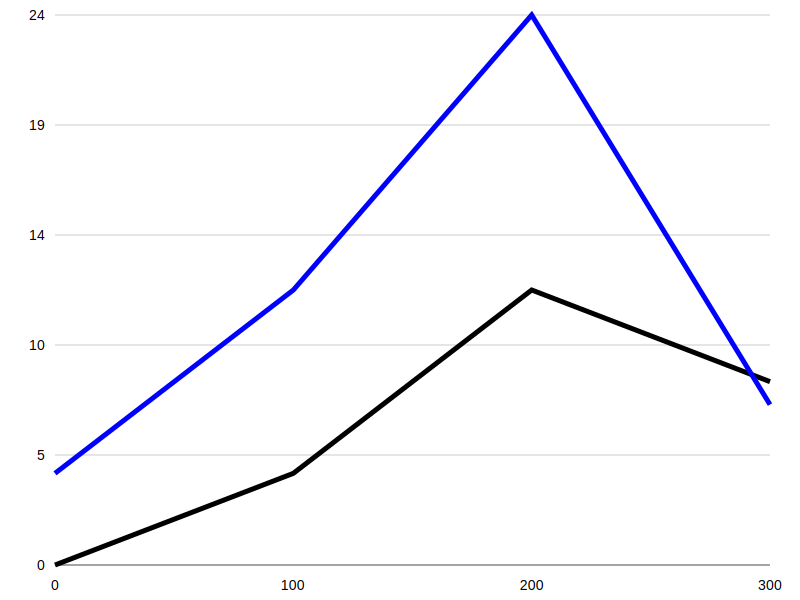
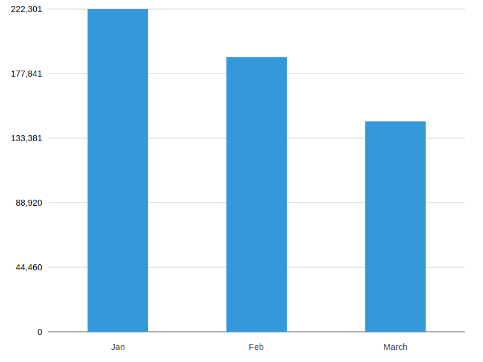
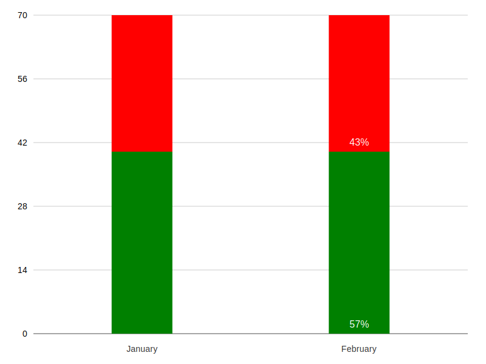
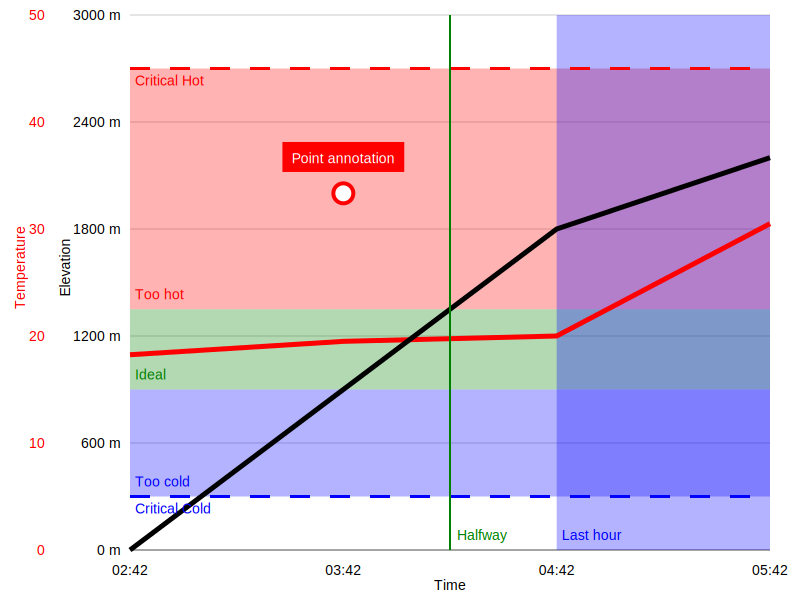
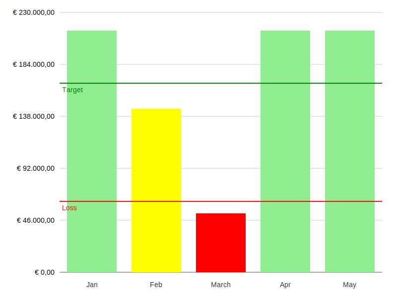
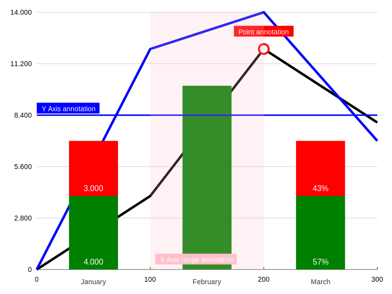

> [!WARNING]
> This library is under active development. The API is unstable and subject to change. Use at your own risk.

# Charts - SVG Chart Rendering

**Charts** is a zero-dependency PHP library for generating SVG charts. It enables easy creation of beautiful and responsive SVG-based charts directly from PHP, with no additional dependencies required.

## Features

- Simple, intuitive API for chart creation
- Lightweight, with no external dependencies
- Supports various chart types: line charts, bar charts, stacked charts, and mixed charts
- Fully customizable and extendable
- Outputs pure SVG, allowing for:
  - Embedding in PDFs (ideal for reports)

## Installation

To get started, install the package via composer:

```bash
composer require maantje/charts
```

## Usage Examples

Below are some examples of the types of charts you can create using this library. Click on the links to view the source code for each example.

### Simple line chart

[View source](./examples/simple-line-chart.php)

### Simple bar chart

[View source](./examples/simple-bar-chart.php)

### Simple stacked chart

[View source](./examples/simple-stacked-bar-chart.php)

### Advanced line charts

[View source](./examples/advanced-line-chart.php)

### Advanced bar chart

[View source](./examples/advanced-bar-chart.php)

### Mixed chart

[View source](./examples/mixed-chart.php)


## Usage

### Creating a Chart

You can create different types of charts using the provided classes. Below are examples of how to create a simple bar chart and a line chart.

#### Simple Bar Chart

```php
use Maantje\Charts\Bar\Bar;
use Maantje\Charts\Bar\Bars;
use Maantje\Charts\Chart;

$chart = new Chart(
    series: [
        new Bars(
            bars: [
                new Bar(name: 'Jan', value: 222301),
                new Bar(name: 'Feb', value: 189242),
                new Bar(name: 'Mar', value: 144922),
            ],
        ),
    ],
);

echo $chart->render();
```

#### Simple Line Chart

```php
use Maantje\Charts\Chart;
use Maantje\Charts\Line\Line;
use Maantje\Charts\Line\Lines;
use Maantje\Charts\Line\Point;

$chart = new Chart(
    series: [
        new Lines(
            lines: [
                new Line(
                    points: [
                        new Point(y: 0, x: 0),
                        new Point(y: 4, x: 100),
                        new Point(y: 12, x: 200),
                        new Point(y: 8, x: 300),
                    ],
                ),
            ],
        ),
    ],
);

echo $chart->render();
```

#### Annotations

You can add annotations to your charts for better visualization.

```php
use Maantje\Charts\Annotations\PointAnnotation;
use Maantje\Charts\YAxis;

$chart = new Chart(
    yAxis: new YAxis(
        annotations: [
            new PointAnnotation(x: 200, y: 120, label: 'Important Point'),
        ],
    ),
    // ...
);
```

## License

The MIT License (MIT). Please see [License File](LICENSE) for more information.
