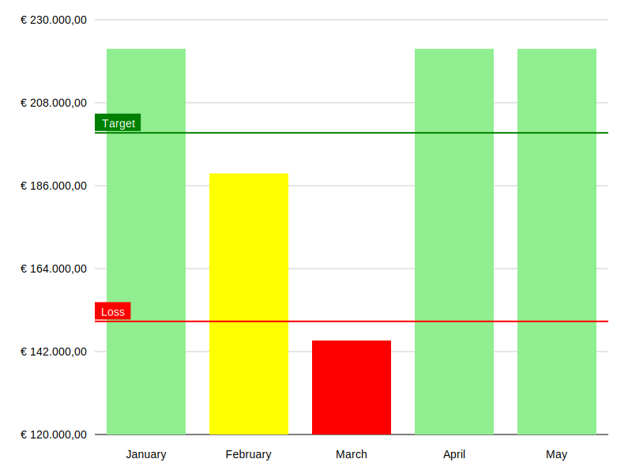

> [!WARNING]  
> This library is under active development. The API is unstable and subject to change. Use at your own risk.

# Charts - SVG Chart Rendering

**Charts** is a zero-dependency PHP library for generating SVG charts. It enables easy creation of beautiful and responsive SVG-based charts directly from PHP, with no additional dependencies required.

## Features

- Simple, intuitive API for chart creation
- Lightweight, with no external dependencies
- Supports various chart types: line charts, bar charts, stacked charts, and mixed charts
- Fully customizable and extendable
- Outputs pure SVG, allowing for:
  - Embedding in PDFs (ideal for reports)

## Installation

To get started, install the package via composer:

```bash
composer require maantje/charts
```

## Usage Examples

Below are some examples of the types of charts you can create using this library. Click on the links to view the source code for each example.

### Simple line chart

[View source](./examples/simple-line-chart.php)

### Simple bar chart

[View source](./examples/simple-bar-chart.php)

### Simple stacked chart

[View source](./examples/simple-stacked-bar-chart.php)

### Advanced line charts

[View source](./examples/advanced-line-chart.php)

### Advanced bar chart

[View source](./examples/advanced-bar-chart.php)

### Mixed chart

[View source](./examples/mixed-chart.php)

## License

The MIT License (MIT). Please see [License File](LICENSE) for more information.
